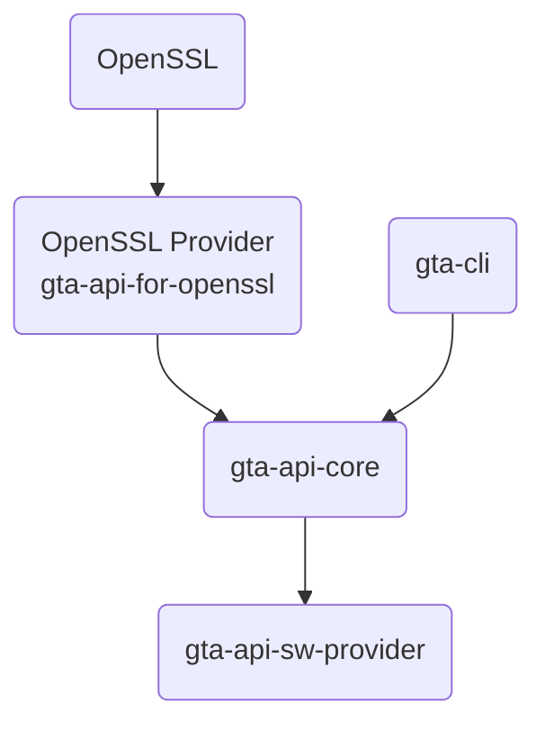

<!--
SPDX-FileCopyrightText: Copyright 2025 Siemens

SPDX-License-Identifier: Apache-2.0
-->

# GTA API for OpenSSL - Proof-Of-Concept OpenSSL Provider

__DISCLAIMER:__
This code is a proof-of-concept for establishing a TLS connection and using CMP with OpenSSL
and using the GTA API to create and store the credentials. In an example, GTA API is
called in a custom OpenSSL provider for the client authentication during the TLS
handshake.

Current limitations in OpenSSL provider:
* CA certificate currently not protected using GTA API.
* No proper error handling.
* Probably some memory leaks.
* Currently supports only ECC (NIST P-256) and Dilithium2 (needs to be updated)

Additional feature:
* Send certificate signing request with [RFC 4210](https://datatracker.ietf.org/doc/html/rfc4210) protocol.
* Send certificate key update request with [RFC 4210](https://datatracker.ietf.org/doc/html/rfc4210) protocol.
* Protect the CA certificates in case of [RFC 4210](https://datatracker.ietf.org/doc/html/rfc4210) protocol.

Component structure:


## Prerequisite 
The following tools and libraries need to be installed for build and run the demo project.

### Build dependencies

- __GTA API Core:__ Generic Trust Anchor API for Industrial IoT devices. Details are described in [ISO/IEC TS 30168](https://www.iso.org/standard/53288.html).
    * Follow the installation guideline on the [GTA API Core](https://github.com/generic-trust-anchor-api/gta-api-core.git) web page.  

- __GTA API Software Provider:__ Generic Trust Anchor API SW Provider. This project implements a Software-based Provider for the Generic Trust Anchor API and can be used by gta-api-core.
    * A `merged static library` is needed for the OpenSSL Provider. It can be downloaded as build artifact from the [GTA Software Provider](https://github.com/generic-trust-anchor-api/gta-api-sw-provider.git) project.
    * It is intended for development only and not for productive use.
    * In case of Dilithium 2, the post quantum crypto needs to be activated (in the gta-api-sw-provider/__meson_options.txt__):
        ```
        # SPDX-FileCopyrightText: Copyright 2024 Siemens
        #
        # SPDX-License-Identifier: Apache-2.0

        option('build', type : 'combo', choices : ['debug', 'release' ], value : 'debug', description : 'Select build type with associated tool configuration')
        option('build-dependencies', type : 'boolean', value : true, yield: true, description : 'Select whether to build dependencies locally rather than use system installed libraries.')
        option('disable-deprecated-warnings', type : 'boolean', value : true, description : 'Select whether or not warnings for deprecated functions are displayed.')
        option('enable-post-quantum-crypto', type : 'boolean', value : false, description : 'This switch enables post quantum crypto algorithms.')
        option('enable-test-log', type : 'boolean', value : false, description : 'This switch enables log messages for the provider tests.')
        option('build-examples', type : 'boolean', value : false, description : 'This switch enables the build of examples.')
        ```

- __Additional development and test packages:__
    * __strace__: to intercept and record the system calls or event of an application.
    * In case of the debian based Linux: 
      ```
      apt -y install build-essential curl git unzip llvm llvm-dev strace
      ```   
               
### Runtime dependencies 

- __OpenSSL 3.2.x (or newer):__ OpenSSL 3.2.0 needs to be installed on the system.

- __GTA CLI:__ GTA API command line interface to call the GTA SW provider.
    * It is intended for development only and not for productive use.
    * Follow the installation guideline on the [gta_cli](https://github.com/generic-trust-anchor-api/gta-cli.git) web page. 
      
## Build demo 

* Compile and install the OpenSSL provider and helper programs:
  ```
  make
  sudo make install
  ```
* Optional compiler parameters in the Makefile:
    * Enable EC: __-DEC_ON__
    * Enable Dilithium: __-DDILITHIUM_ON__
    * Enable log all byte array: __-DLOG_BYTE_ARRARY_ON__
    * Enable log all base 64 string: __-DLOG_B64_ON__
    * Enable log all base 64 string: __-DLOG_FOR_CYCLE_ON__
    * Selected log level: __-DLOG_LEVEL=0__ (TRACE 0 | DEBUG 1 | INFO  2 | WARN  3 | ERROR 4)
* Optional parameters to change install traget: 
    * OPENSSL_MODULES_DIR ?= /lib/x86_64-linux-gnu/ossl-modules/


## Run TLS demo

* Change to the `demo` directory and create the necessary keys and certificates:
    * __Elliptic Curve__ key material and certificates: 
        ```
            cd demo
            ./prepare_demo.sh
        ```

* In one terminal change into the server directory and start the server:
  ```
  cd server
  ./start_server.sh
  ```
* In another terminal change into the client directory and start the client:
  ```
  cd client
  ./start_client.sh
  ```

## Run CMP demo

* Change to the `demo` directory and create the necessary keys and certificates:
    * __CMP__ key materials and certificates: 
        ```
            cd demo
            ./prepare_cmp_demo.sh
        ```

* In one terminal change into the cmp directory and run a cmp client to sign a certificate:
  ```
  cd cmp
  ./send_cr_cmp_message.sh
  ```
* In the terminal, run a cmp client to update key of a certificate:
  ```
  cd cmp
  ./send_kur_cmp_message.sh
  ```

## Run integration tests
* Test OpenSSL provider and helper programs:
  ```
  make
  sudo make install 
  make test
  ```
